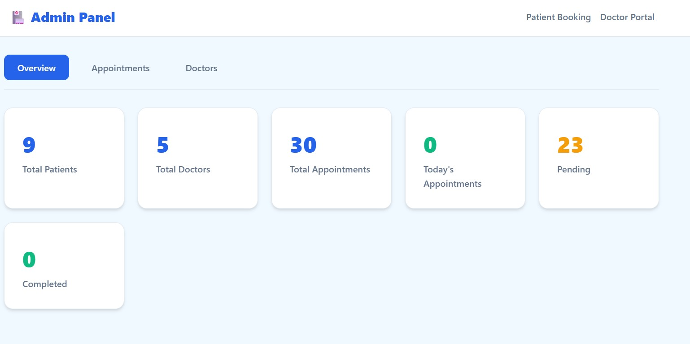
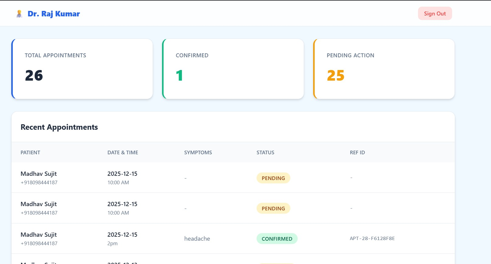
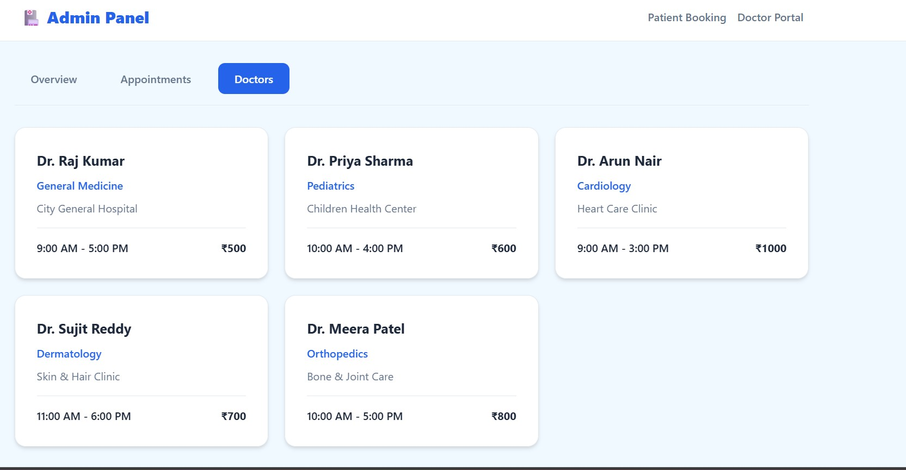
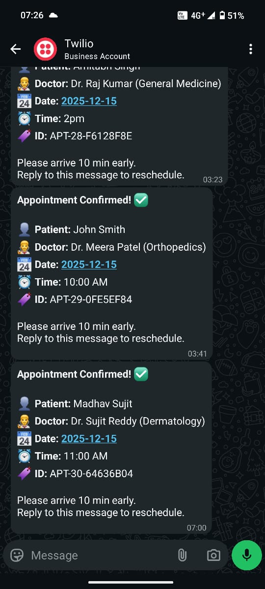
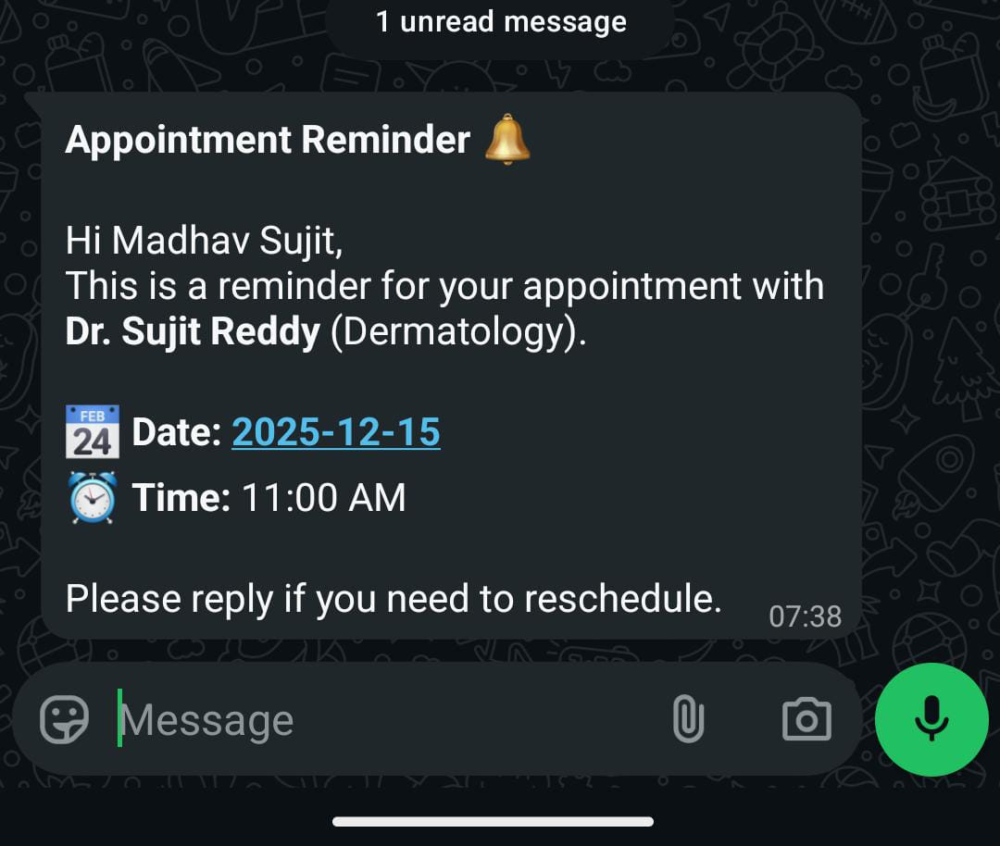
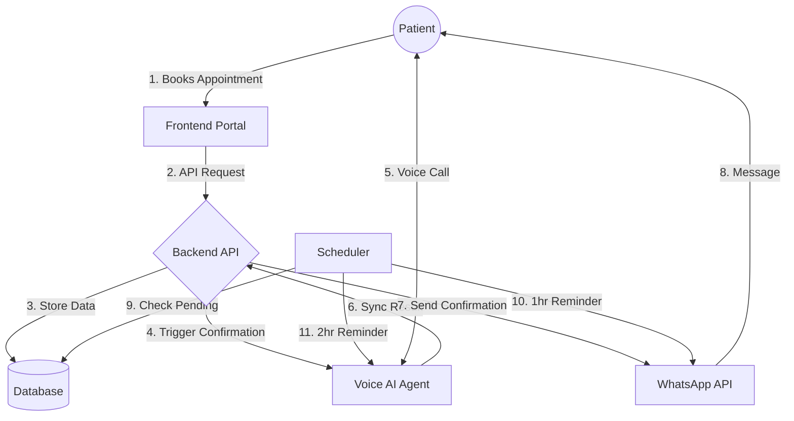

# Doctor Appointment Booking Voice AI Agent (Breakpoint-25)

> **A Next-Gen Healthcare Booking System powered by Voice AI.**

This repository contains the **Doctor Booking Agent**, an AI-driven system that automates patient appointment confirmations and symptom checking.

## Key Features

- **WhatsApp Booking**: Seamless integration for booking appointments via WhatsApp.
- **Multilingual Support**: AI agent capable of conversing in multiple languages.
- **Smart Follow-ups**: Automated reminder calls scheduled 1 hour and 2 hours before appointments.


### Web Interface

| **Admin Dashboard** | **Doctor Dashboard** |
| :---: | :---: |
|  |  |

| **Doctor Profile** | **Analytics View** |
| :---: | :---: |
|  |  |

### 📱 WhatsApp Integration

| **Appointment Confirmation** | **Follow-up Reminder** |
| :---: | :---: |
|  |  |

## Repository Structure

- **`doctor_booking_agent/`**: The main application code (Frontend + Backend + Agent Logic).
  - See [Application Documentation](doctor_booking_agent/README.md) for setup and usage.
- **`prompts/`**: Contains the system prompts and templates used by the AI.
  - `english.txt`: The base persona text.
  - `prompt.txt`: The active XML-based system prompt.
  - `evaluationTool.json`: The schema for call evaluation and data extraction.
- **`evaluationTool.json`**: Reference copy of the evaluation schema.
- **`endCall.js` / `sessionNotes.js`**: Helper scripts for call management.
## System Architecture




## Quick Start

To run the full application (Frontend and Backend), navigate to the application folder:

```bash
cd doctor_booking_agent
# Follow instructions in doctor_booking_agent/README.md
```

## Configuration Reference

### Call Evaluation Schema
The agent uses a specific JSON schema to evaluate calls and extract booking details. See `prompts/evaluationTool.json` for the definition.

### Voice Activity Detection (VAD) Settings
The following VAD engines are supported for the voice agent:

| Engine    | Start   | End   | Character         | Use Case |
| --------- | ------- | ----- | ----------------- | -------- |
| **LOKEN**     | instant | 100ms | Responsive        | Testing, baseline, clean audio |
| **KAAN**      | 50ms    | 550ms | Aggressive        | Need fastest response, accept false triggers |
| **POLUX**     | 128ms   | 160ms | Balanced          | Noisy environment, need stability |
| **ANCHORITE** | 200ms   | 800ms | Patient           | Very conservative, minimize interruptions |
| **CALGAR**    | 50ms    | 400ms | Fast-in, slow-out | Good all-rounder for telephony |
| **VALDOR**    | 50ms    | 400ms | Fast-in, slow-out | **Production default** - best balance |
| **CAWL**      | 50ms    | 400ms | Fast-in, slow-out | Maximum performance, have native libs |

## Tools and Scripts

- **Makefile**: Contains commands to query the call server.
- **Postman Collection**: [View Documentation](https://documenter.getpostman.com/view/29008927/2sB3dSQUQE)

