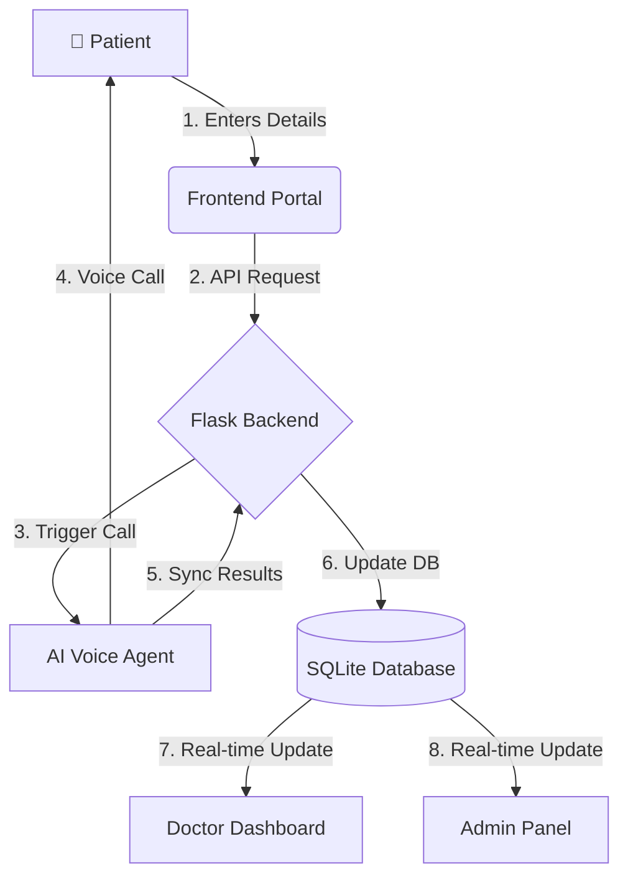

# Doctor Appointment Booking Voice AI Agent

> **A Next-Gen Healthcare Booking System powered by Voice AI, Real-time Sync, and Modern Web Technologies.**


---

## Overview

This project is a complete **Doctor Appointment Booking System** where patients can book appointments via a web portal, and an **AI Voice Agent** immediately calls them to confirm details, check symptoms, and finalize the booking.

The system features a **Real-time Dashboard** for doctors and admins to view appointments as they happen.

### Key Features

*   **AI Voice Receptionist**: Automatically calls patients to confirm bookings using natural language.
*   **Patient Portal**: Modern, responsive UI for users to request appointments.
*   **Doctor Dashboard**: Real-time view of appointments, patient details, and symptoms.
*   **Admin Panel**: Comprehensive overview of hospital stats, doctors, and booking history.
*   **Real-time Sync**: Call results and transcripts are instantly synced to the database.
*   **WhatsApp Integration**: Sends booking confirmations via WhatsApp (Twilio).

---

## System Flow



1.  **Booking Request**: Patient submits phone number & preference on the web portal.
2.  **AI Activation**: Backend triggers the Voice AI Agent.
3.  **Voice Interaction**: AI calls the patient, confirms availability, and asks about symptoms.
4.  **Data Sync**: Call outcome (Confirmed/Cancelled, Symptoms) is saved to the database.
5.  **Dashboard Update**: Doctor sees the new appointment appear instantly.

---

## Project Structure

The project is organized into three main modules:

```
doctor_booking_agent/
├── 📂 frontend/          # Next.js Web Application
│   ├── pages/            # Patient, Doctor, and Admin pages
│   └── styles/           # Global CSS and themes
│
├── 📂 backend/           # Flask API Server
│   ├── hospital_api.py   # Main API endpoints
│   ├── models.py         # Database Schema (SQLAlchemy)
│   └── instance/         # SQLite Database
│
├── 📂 agent/             # AI Logic
│   ├── src/              # Prompts & Dinodial Client
│   └── sync_call.py      # Webhook handler for call results
│
```

---

## Getting Started

### Prerequisites

*   **Node.js** (v16+)
*   **Python** (v3.9+)
*   **Dinodial/Twilio Credentials** (in `.env`)

### Installation

1.  **Clone the repository**
    ```bash
    git clone <repo-url>
    cd doctor_booking_agent
    ```

2.  **Backend Setup**
    ```bash
    # Create virtual environment
    python -m venv venv
    source venv/bin/activate  # or venv\Scripts\activate on Windows

    # Install dependencies
    pip install -r backend/requirements.txt
    ```

3.  **Frontend Setup**
    ```bash
    cd frontend
    npm install
    ```

### Running the Application

We have provided a convenient script to start everything at once:


**Manual Start:**
*   **Backend**: `cd backend && python hospital_api.py` (Port 5000)
*   **Frontend**: `cd frontend && npm run dev` (Port 3000)

---

## Usage

| Portal | URL | Description |
| :--- | :--- | :--- |
| **Patient Booking** | [http://localhost:3000](http://localhost:3000) | Book appointments & trigger AI calls. |
| **Doctor Login** | [http://localhost:3000/doctor-login](http://localhost:3000/doctor-login) | Login to view schedule. <br>*(Default: `dr.raj@hospital.com` / `pass123`)* |
| **Admin Panel** | [http://localhost:3000/admin](http://localhost:3000/admin) | View hospital statistics and logs. |

---

## Tech Stack

*   **Frontend**: Next.js, React, CSS Modules
*   **Backend**: Flask, SQLAlchemy, SQLite
*   **AI/Voice**: Dinodial Proxy API, Twilio
*   **Tools**: Python, Node.js, Axios

---

Made with ❤️ for the **Dinodial Hackathon 2025**
